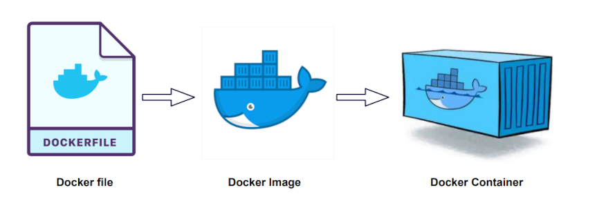

# Atelier GAN - Docker

Pour l’installation de Docker, consultez le site officiel : [https://www.docker.com/](https://www.docker.com/)  

Docker est une **technologie de conteneurisation** qui permet d’exécuter des applications de manière **isolée, portable et reproductible**. Il facilite le déploiement en encapsulant **le code, les dépendances et la configuration** dans des **conteneurs**.


---

### Qu'est-ce qu'un conteneur Docker ?  
Un **conteneur** est une **unité logicielle légère et isolée** qui contient tout le nécessaire pour exécuter une application (**code, librairies, dépendances, configuration**).  
Il fonctionne indépendamment du **système d’exploitation sous-jacent**, ce qui permet une exécution homogène sur **différentes machines**.

---

### Qu'est-ce qu'une image Docker ? 

Une **image Docker** est un **modèle préconfiguré** qui contient le **code de l’application, son environnement et ses dépendances**.  

Vous pouvez trouver de nombreuses **images prêtes à l'emploi** sur **[Docker Hub](https://hub.docker.com/)**.

---

### **Qu'est-ce que Docker Compose ?**  
[Docker Compose](https://docs.docker.com/compose/) est un outil qui permet de **gérer plusieurs conteneurs** avec un seul fichier **`docker-compose.yml`**.  
Il est **idéal pour les architectures complexes** (ex: **API FastAPI + Base de données**).


**Exemple : Définir un service API FastAPI avec MySQL dans `docker-compose.yml`**  
```yaml
version: '3.9'

services:
  web:
    image: my-fastapi-app
    ports:
      - "8080:80"
  db:
    image: mysql
    environment:
      - MYSQL_ROOT_PASSWORD=example
```
### **Lancer tous les conteneurs en une seule commande**  
```bash
docker-compose up -d
```

---

### **Résumé**
| **Concept** | **Définition** |
|------------|--------------|
| **Docker** | Plateforme permettant de conteneuriser des applications. |
| **Conteneur** | Instance d’une image Docker qui exécute une application de manière isolée. |
| **Image Docker** | Modèle qui contient l’application et ses dépendances. |
| **Docker Compose** | Outil pour orchestrer plusieurs conteneurs avec un fichier `docker-compose.yml`. |

---

## **Conteneurisation de notre API GAN**
Nous allons **conteneuriser l’API GAN** avec **Docker**.

### **Générer les dépendances**
Avant de créer l’image, assurez-vous que toutes les **dépendances Python** sont bien listées :
```bash
pip freeze > requirements.txt
```
Ce fichier **requirements.txt** sera utilisé pour **installer les bibliothèques** dans le conteneur.

## **Création du `Dockerfile`**
L’image utilisée pour le conteneur sera créée à partir d’une **image Python** en utilisant le fichier `Dockerfile` suivant :

```dockerfile
FROM python:3.11

WORKDIR /code
COPY ./requirements.txt /code/requirements.txt
RUN pip install --no-cache-dir --upgrade -r /code/requirements.txt
COPY ./app /code/app
```
- **Le `RUN` installe `pip` avec le `requirements.txt`**  
- **Le `COPY` ajoute le code source dans l’image (`app → /code/app`)**

### **Création du fichier `.dockerignore`**
Le fichier `.dockerignore` permet **d’exclure certains fichiers** du contexte de construction.  

Ajoutez les **éléments à ignorer**, notamment :  
```
.venv/
.pytest_cache/
__pycache__/
```
**Cela évite d’intégrer des fichiers inutiles dans l’image Docker.**

### **Création du `docker-compose.yml`**
Nous allons utiliser **Docker Compose** pour **orchestrer notre conteneur**.

```yaml
version: "3.9"

services:
  web:
    build:
      context: .  # Chemin vers le répertoire contenant le Dockerfile
      dockerfile: Dockerfile  # Facultatif si le fichier s'appelle Dockerfile
    container_name: api_gan
    ports:
      - "8081:80"  # Redirige le port 8000 de l'hôte vers le port 80 du conteneur
    volumes:
      - ./app:/code/app  # Montage pour recharger automatiquement le code (optionnel)
      - ./requirements.txt:/code/requirements.txt  # Montage pour recharger automatiquement les dépendances (optionnel)
      - ./images:/code/images
    environment:
      - PYTHONUNBUFFERED=1  # Assure que les logs apparaissent immédiatement dans la console
    working_dir: /code/app   # 👈 change de répertoire
    command: ["uvicorn", "main:app", "--host", "0.0.0.0", "--port", "80"]
```

**Explication du `docker-compose.yml`**
- `version: "3.9"` : Indique la version de Docker Compose.
- `services:` : Déclare un service `web` pour l’API.
- `build:` : Spécifie que l’image sera construite avec `Dockerfile` en local.
- `container_name: api_gan` : Définit un nom personnalisé pour le conteneur.
- `ports: "8081:80"` : Redirige le port `8081` de l'hôte vers le port `80` du conteneur.
- `volumes:` : Permet d’utiliser les fichiers du système hôte dans le conteneur.
- `environment:` : Ajoute des variables d’environnement, ici `PYTHONUNBUFFERED=1` pour des logs immédiats.
- `command:` : Démarre **FastAPI** avec `uvicorn`.

### **Construire et démarrer les conteneurs**
```bash
docker-compose up -d --build
```

**Explication :**
- `up -d` → Démarre le conteneur en arrière-plan.
- `--build` → Reconstruit l’image si des modifications ont été apportées.

### **Vérifier que le conteneur tourne**
```bash
docker ps
```
Cette commande affiche la liste des conteneurs en cours d’exécution.

### **Tester l’API dans le navigateur**
Accédez à la **documentation interactive Swagger** :
```
http://localhost:8081/docs
```

### **Arrêter et supprimer les conteneurs**
```bash
docker-compose down
```
Cette commande arrête et supprime les conteneurs créés avec Docker Compose.
