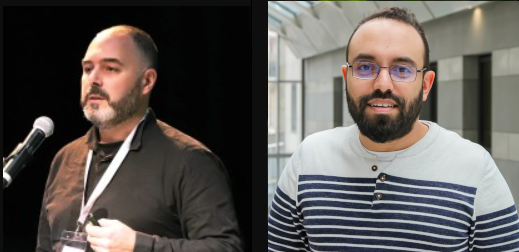

# Atelier GAN - Génération de visages

Dans cet atelier, nous allons découvrir les **GANs (Generative Adversarial Networks)**, une famille de modèles d’intelligence artificielle capables de **générer des images réalistes à partir de bruit aléatoire**. Un GAN fonctionne grâce à l’opposition de deux réseaux de neurones : un **générateur**, qui produit de fausses images, et un **discriminateur**, qui apprend à les distinguer des vraies.

Nous mettrons en pratique ce principe en **entraînant un GAN à générer des visages humains** à partir d’un jeu de données. Une fois le modèle entraîné, nous l’intégrerons dans une **API web** capable de produire des visages synthétiques à la demande.

**📅 Durée : 2 jours** 

## **Intervenants :**  
- **Kheireddin Kadri** - Chercheur R&D Aptiskills, intervenant dans différents établissements  
- **Stéphane Jamin-Normand** - Enseignant à l'ISEN, formateur référent de l'école IA

## Labs disponibles

| Domaine      | Dataset         | Notebook                          |
|--------------|-----------------|-----------------------------------|
| Images       | MNIST/CelebA    | `02_labs/images_gan/train_gan_images.ipynb` |
| Molécules    | ZINC/ChEMBL     | `02_labs/molecules_gan/train_gan_molecules.ipynb` |
| Cristaux     | Materials Project | `02_labs/crystals_gan/train_gan_crystals.ipynb` |
| Visage       | CelebA            | `02_labs\Human_faces\GAN_faces.ipynb` |

## Objectifs pédagogiques du cours
Au cours de ces deux journées, les participants pourront :

- Comprendre les fondements mathématiques des GANs.
- Identifier les différents types de GANs (DCGAN, WGAN, CGAN, CycleGAN, etc.).
- Évaluer un modèle GAN à l’aide de métriques pertinentes.
- Implémenter pas à pas plusieurs architectures GANs en PyTorch et/ou TensorFlow à travers des notebooks pratiques.
- Appliquer les GANs à des jeux de données variés : images, spectres de molécules, structures de graphes, texte, IRM médicales…
- Comprendre les défis actuels des GANs : stabilité de l’entraînement, collapse de mode, qualité/diversité, etc.
- Construire une visualisation **MLops** via MLflow
- Comprendre le CI/CD à travers les tests automatiques et le déploiement

Cet atelier est conçu pour être **pratique et immersif**, avec un focus sur un **cas d'usage réel** pour mieux comprendre l'application des **GANs** à la génération d'images entre autres. 

## Déroulé de l'atelier

- [Chapitre 1 : Les GANs](https://github.com/Stephane-ISEN/atelierGAN/tree/ch1_gan)
- [Chapitre 2 : MLFlow](https://github.com/Stephane-ISEN/atelierGAN/tree/ch2_mlflow)
- [Chapitre 3 : Wepscraping](https://github.com/Stephane-ISEN/atelierGAN/tree/ch3_wepscraping)
- [Chapitre 4 : GANs servis dans une Web API](https://github.com/Stephane-ISEN/atelierGAN/tree/ch4_api)
- [Chapitre 5 : conteneurisation avec Docker](https://github.com/Stephane-ISEN/atelierGAN/tree/ch5_docker)
- [Chapire 6 : les test unitaires avec PyTest](https://github.com/Stephane-ISEN/atelierGAN/tree/ch6_tests)
- [Chapitre 7 : les tests automatique sous GitHub](https://github.com/Stephane-ISEN/atelierGAN/tree/ch7_git)
- [Chapitre final : le code complet de l'atelier](https://github.com/Stephane-ISEN/atelierGAN/tree/ch8_final)

### **Contact**
📧 kheireddin.kadri@ext.devinci.fr

