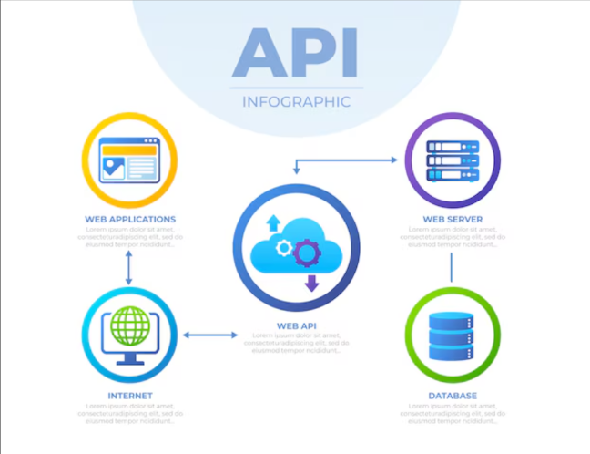
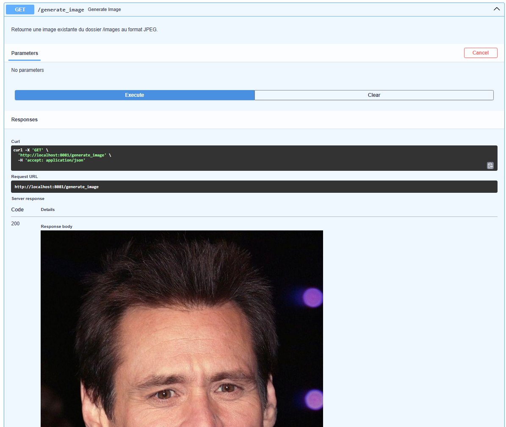
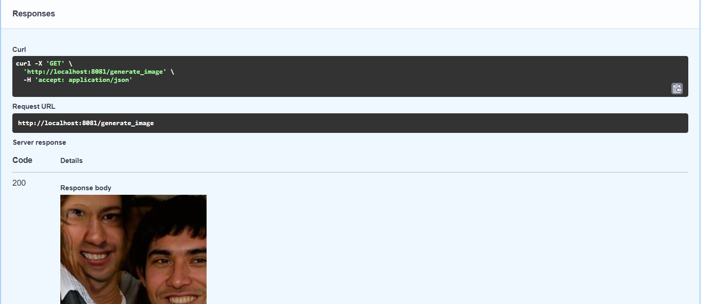

# Atelier GAN - Web API

Déployer un modèle d'intelligence artificielle via une **API** permet de le rendre **accessible, scalable et facilement intégrable** dans divers systèmes, sans nécessiter de redéploiement à chaque utilisation.



### Principaux avantages

* **Accessibilité** → Toute application (web, mobile, backend) peut envoyer des requêtes et obtenir des prédictions en temps réel.
* **Scalabilité** → L’API permet d’héberger le modèle sur un serveur centralisé et de gérer plusieurs requêtes simultanément.
* **Mise à jour simplifiée** → Il est possible d’améliorer ou de remplacer le modèle sans impacter les utilisateurs finaux.
* **Interopérabilité** → Le modèle peut être exploité par des applications écrites dans différents langages (Python, JavaScript, Java…).
* **Sécurité** → L'API permet de contrôler les accès au modèle et de protéger les données sensibles.

---

## FastAPI

[FastAPI](https://fastapi.tiangolo.com/) est un **framework Python rapide et performant** pour créer des **API RESTful**. Il est particulièrement adapté à l’exposition de modèles d’IA, car il permet :

* de gérer facilement les requêtes HTTP,
* d’assurer une **exécution asynchrone optimisée**,
* d’intégrer automatiquement une **documentation interactive** via `/docs`.


### Endpoint dans FastAPI

Un **endpoint** est une route définie dans FastAPI qui répond à une requête HTTP (`GET`, `POST`…).
Il permet d’exécuter une fonction spécifique, comme **recevoir une image et retourner une prédiction** d’un modèle d’IA.

### Uvicorn

[Uvicorn](https://www.uvicorn.org/) est un **serveur ASGI** (Asynchronous Server Gateway Interface) qui exécute les applications **FastAPI** de manière **très rapide** et **asynchrone**.
Il est essentiel pour **mettre l’API en production** et gérer efficacement les requêtes entrantes.

---

## Mise en place de l'API

- Commencez par créer un nouveau répertoire de travail. 
- Téléchargez les fichiers de cette branche.
- Placer les sources dans votre répertoire de travail en respectant la structure proposée.

### Installation de l’environnement

Sur la machine de travail, commencez par **créer et activer un environnement virtuel** dans le répertoire de projet :

```bash
python -m venv venv
source venv/bin/activate  # Sur macOS/Linux
venv\Scripts\activate  # Sur Windows
```

### Installation des dépendances

Installez les bibliothèques nécessaires à l'API :

```bash
pip install --upgrade -r requirements.txt
```

---

## Développement de la Web API

### Présentation de l’architecture

L’architecture repose sur un répertoire `app` contenant l’ensemble du code.

* Le dépôt de référence est, comme pour le notebook, [ce dépôt GitHub](https://github.com/NVlabs/stylegan3), à partir duquel a été réalisée une simplification.

* Les fichiers clés sont :

  * `gen_image.py` → sert uniquement pour tester le modèle hors API.
  * `legacy.py`, le répertoire `/dnnlib` et `/torch_utils` → indispensables pour faire fonctionner le modèle GAN comme dans les exemples des notebooks fournis.

Tout le code API est centralisé dans le fichier `main.py` situé dans le dossier `app`.

---

### **Fichier `main.py`**

Ce fichier contient une première API qui sert simplement une image enregistrée localement :

```python
import torch
import legacy
from PIL import Image
import io
from fastapi import FastAPI, Response
import os
from datetime import datetime

# Répertoire d’images existantes
IMAGE_DIR = "../images"

# Initialise l’application FastAPI
app = FastAPI()

# Fonction pour sélectionner une image existante et retourner ses octets
def generate_stylegan_image(G=None) -> bytes:
    # Chemin vers une image de test
    filename = "jim.jpg"
    filepath = os.path.join(IMAGE_DIR, filename)

    # Charge l’image
    pil_img = Image.open(filepath)

    # Convertit l’image en bytes pour la réponse API
    buffer = io.BytesIO()
    pil_img.save(buffer, format='JPEG')
    return buffer.getvalue()

@app.get("/")
async def index():
    return "API Génération d'image (sans GAN pour le moment) !"

@app.get("/generate_image")
async def generate_image():
    """
    Retourne une image existante du dossier /images au format JPEG.
    """
    image_data = generate_stylegan_image()
    return Response(content=image_data, media_type="image/jpeg")
```

---

### **Tester l'API**

**Lancer le serveur :**

```bash
uvicorn app.main:app --reload --host 0.0.0.0 --port 8081
```

**Tester l’API dans le navigateur :**
Accéder à la documentation interactive :
`http://127.0.0.1:8081/docs`



---

## Ajout du GAN dans l'API

Maintenant que la structure de l'API est en place, il s’agit d’y intégrer le modèle GAN pour générer un nouveau visage à chaque appel.

### Ajout du modèle GAN

Le modèle **`stylegan3-r-ffhqu-256x256.pkl`** est recommandé car il n’est pas trop volumineux et peut tourner sur un CPU local.

Téléchargement disponible ici :
[stylegan3 de NVidia](https://catalog.ngc.nvidia.com/orgs/nvidia/teams/research/models/stylegan3/files)

Il est conseillé de placer ce fichier dans le répertoire `/app` du projet.

---

### Configuration et chargement du modèle

Modifiez le code pour intégrer le modèle GAN (`StyleGAN3`) dans l’API. Il faut :

* utiliser les modules du dépôt `stylegan3`,
* écrire une fonction qui charge le modèle à partir du fichier `.pkl`,
* récrire la fonction generate_stylegan_image() pour prendre en paramètre un modèle et retourner une image,
* modifier le endpoint `/generate_image` pour appeler ce modèle et générer une nouvelle image à chaque requête.

---

### **Tester l'API**

Relancer le serveur et ouvrir le navigateur comme précédemment.

Il est désormais possible de générer des visages réalistes directement depuis le navigateur web.



